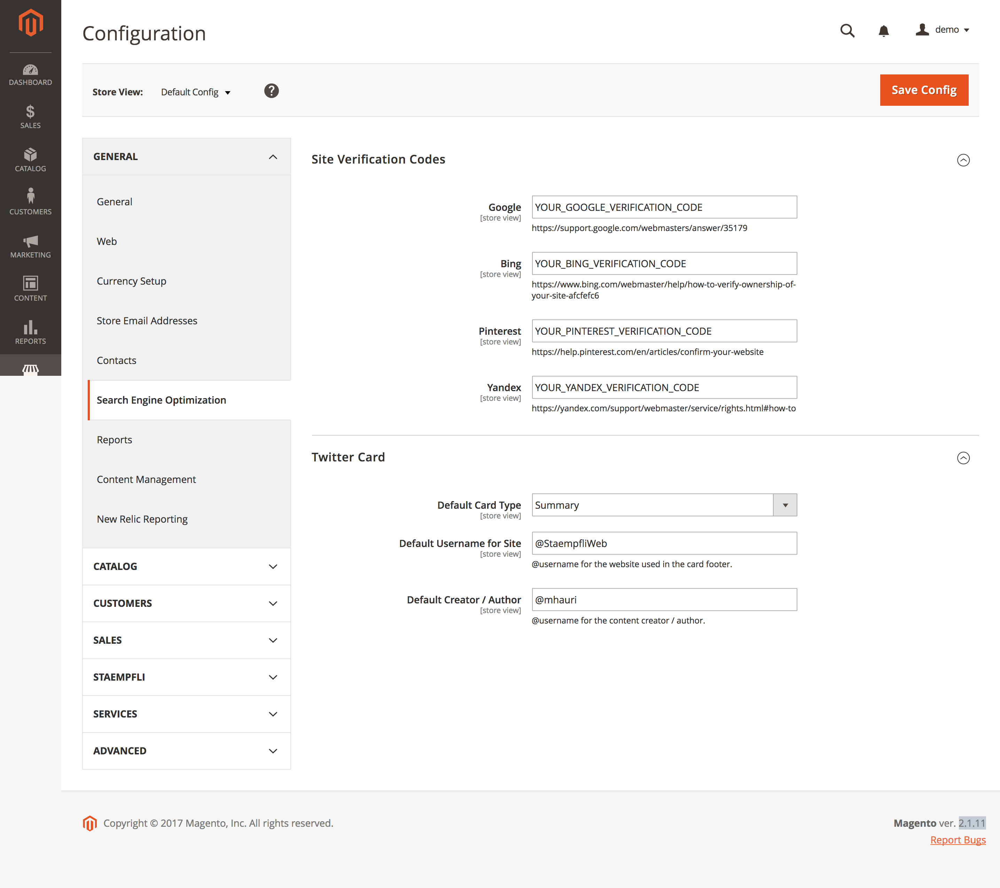

# Magento 2 Search Engine Optimization

[](https://www.codacy.com/app/Staempfli/magento2-module-seo?utm_source=github.com&amp;utm_medium=referral&amp;utm_content=staempfli/magento2-module-seo&amp;utm_campaign=Badge_Grade)
[](https://travis-ci.org/staempfli/magento2-module-seo)
[](https://codeclimate.com/github/staempfli/magento2-module-seo/maintainability)
[](https://codeclimate.com/github/staempfli/magento2-module-seo/test_coverage)

Magento 2 Module to Improve Search Engine Optimization (SEO) on your Magento site.


## Usage

The Module will automatically optimize and improve the performance of your Magento-based store in Search Engines.

By Adding: 

- [TwitterCards](https://developer.twitter.com/en/docs/tweets/optimize-with-cards/guides/getting-started)
   - For CMS Pages
        ```html
        <meta name="twitter:title" content="Home page" />
        <meta name="twitter:description" content="CMS homepage content goes here." />
        <meta name="twitter:url" content="http://example.com/" />
        <meta name="twitter:card" content="summary" />
        <meta name="twitter:site" content="@StaempfliWeb" />
        <meta name="twitter:creator" content="@mhauri" />
        ```

    - For Categories
        ```html
        <meta name="twitter:title" content="Demo Category" />
        <meta name="twitter:url" content="http://example.com/demo-category.html" />
        <meta name="twitter:description" content="This is a Demo Category" />
        <meta name="twitter:image" content="http://example.com/media/catalog/category/demo.png" />
        <meta name="twitter:card" content="summary" />
        <meta name="twitter:site" content="@StaempfliWeb" />
        <meta name="twitter:creator" content="@mhauri" />
        ```

    - For Products
        ```html
        <meta name="twitter:title" content="Demo Product" />
        <meta name="twitter:description" content="Demo Product Short Description" />
        <meta name="twitter:image" content="http://example.com/media/catalog/product/cache/0f831c1845fc143d00d6d1ebc49f446a/o/p/demo.png" />
        <meta name="twitter:url" content="http://example.com/demo-product.html" />
        <meta name="twitter:card" content="summary" />
        <meta name="twitter:site" content="@StaempfliWeb" />
        <meta name="twitter:creator" content="@mhauri" />
        ```
    
- [Structured Data](http://ogp.me/)

    - For CMS Pages
        ```html
        <meta property="og:title" content="Home page" />
        <meta property="og:description" content="CMS homepage content goes here." />
        <meta property="og:url" content="http://example.com/" />
        ```
        
    - For Categories
        ```html
        <meta property="og:title" content="Demo Category" />
        <meta property="og:url" content="http://example.com/demo-category.html" />
        <meta property="og:description" content="This is a Demo Category" />
        <meta property="og:image" content="http://example.com/media/catalog/category/demo.png" />
        ```
          
    - For Products
        ```html
        <meta property="og:title" content="Demo Product" />
        <meta property="og:description" content="Demo Product Short Description" />
        <meta property="og:image" content="http://example.com/media/catalog/product/cache/0f831c1845fc143d00d6d1ebc49f446a/o/p/demo.png" />
        <meta property="og:url" content="http://example.com/demo-product.html" />
        <meta property="og:type" content="og:product" />
        <meta property="product:price:amount" content="125.5" />
        <meta property="product:price:currency" content="CHF"/>
        ```

- [Language annotations](https://support.google.com/webmasters/answer/189077?hl=en)
    ```html
    <link rel="alternate" hreflang="fr" href="http://example.com/fr/content-pages/demo.html" />
    <link rel="alternate" hreflang="en" href="http://example.com/en/content-pages/demo.html" />
    ```
## Webmaster Tools
Allowing you to set the verification code in the backend for:

- Google Webmaster Tools
- Bing Webmaster Tools
- Pinterest
- Yandex webmaster Tools



```html
<meta name="google-site-verification" content="YOUR_GOOGLE_VERIFICATION_CODE" />
<meta name="msvalidate.01" content="YOUR_BING_VERIFICATION_CODE" />
<meta name="p:domain_verify" content="YOUR_PINTEREST_VERIFICATION_CODE" />
<meta name="yandex-verification" content="YOUR_YANDEX_VERIFICATION_CODE" />
```

## Robots (robots.txt)

See: [Robots Configuration](docs/Robots.md)

## Requirements

- PHP: 7.0.x | 7.1.x
- Magento 2.1.x | 2.2.x

Support
-------
If you have any issues with this extension, open an issue on [GitHub](https://github.com/staempfli/magento2-module-seo/issues).

Contribution
------------
Any contribution is highly appreciated. The best way to contribute code is to open a [pull request on GitHub](https://help.github.com/articles/using-pull-requests).

Developer
---------
Marcel Hauri, and all other [contributors](https://github.com/staempfli/magento2-module-seo/contributors)

License
-------
[Open Software License ("OSL") v. 3.0](https://opensource.org/licenses/OSL-3.0)

Copyright
---------
(c) 2017, Stämpfli AG
