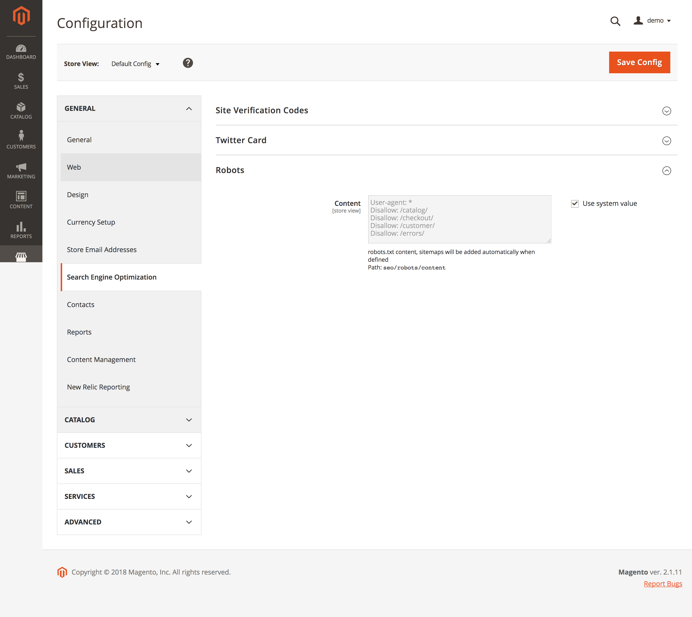

# Robots Configuration

The Robots sections allows you to configure the robots.txt for each website.
It will also add automatically the Sitemaps when defined in "Marketing > Sitemap" 

To make the /robots.txt available to the public you  have to add a new rule to the URL Rewrites for each store.

## URL Rewrites (Only Magento 2.1.x)
You can define a robots.txt in the "URL Rewrites" section.
1. Crete a URL Rewrite from type "Custom"
2. as Request Path use "robots.txt"
3. as Target Path use "robots/index/index"
4. Do not use Redirect and save.

